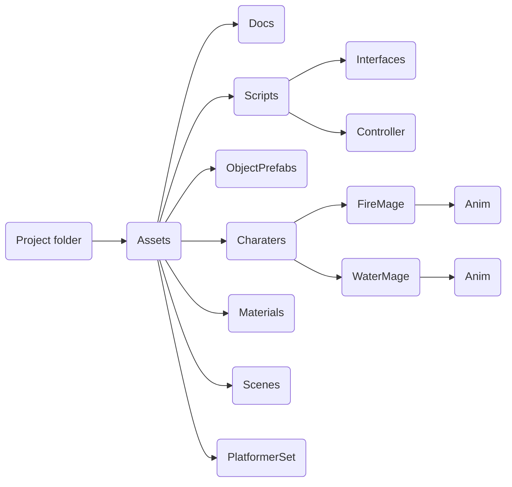

# Firemage and Watermage

Эта игра была вдохновлена старой flash игрой fireboy and firegirl. Идея была обдумана, принята почти в исходном виде и перенесена на движок Unity. Игра состоит в том, чтобы вместе со своим другом решать головоломки, и провести своих персонажей до конца уровней.

## Управление 

Для игры нужно два устройства управления, например 2 геймпада, 2 клавиатуры, или 1 клавиатура и 1 геймпад. 

## Структура проекта

Структура проекта весьма проста:

В папке *Docs* Находится документация к коду игры.

В папке *Scripts* cодержатся все скрипты игры.

В папке *Prefabs* находятся заранее заготовленные объекты, такие как двери, кубы, кнопки, рычаги и жидкости. Так, их не придется создавать каждый раз, или можно изменять все объекты на сценах одновременно.

В папке *Charaters* хранятся оба персонажа игры. Кроме того, каждому персонажу соответствует еще своя папка *Anim*, в которой харанятся все необходимые файлы для анимации персонажей.

В папке *PlatformerSet* хранятся текстуры и тайлы сцены.

В папке *Scenes* хранятся игровые сцены.

## Реализация

Документацию к коду можно посмотреть, открыв*Assets/Docs/annotated.html* или в самом коде

## Что можно реализовать в будущем
На данный момент игра - лишь демоверсия того, чем она может стать. 
 - Уровни. В оригинальной игре было множество разных уровней, которые можно перенести, или которыми можно вдохновляться при создании новых уровней
 - Больше различных элементов головоломок. Например потоки воздуха, поднимающие предметы вверх, или элементы, напрямую завязанные на стихию игрока.
 - Волшебство. Возможно, игрокам на будущих уровнях будет представлена возможность делать то, чем их персонажи и должны заниматься. А именно - колдовать и использовать свою стихию.
 - Сюжет. Сейчас в игре есть лишь голые механики, и лишь микроскопический налет сюжета. Но в будущем можно добавить и более обширную сюжетную линию, завязанную на магов-последователей оригинальных персонажей игры Fireboy and Watergirl.
 - Звуки. В игре нет звуков, и это не правильно. В будущем, это необходимо исправить. Звуки руин, фоновая музыка, и возможно озвучка персонажей... Все это в возможном будущем.

## Создатель и благодарности

Создал игру Мареев Максим, студент ГУАП, группа 4321, его контакты приведены ниже
- Telegram: [@FunnCo](https://t.me/funnco)
- Github: [Funnco](https://github.com/FunnCo)
- VK: [Мареев Максим](https://vk.com/funnco)

Отдельную благодарность хотелось бы выразить Усталому Аркадию, который поддерживал во время разработки, и, фактически, стал причиной, почему игра была написана именно такой, какая она есть сейчас.
